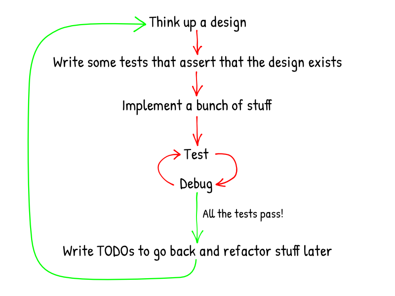

# Test-Driven Development as if you meant it
An exercise for pushing Test-Driven Development to its limits. 
Originally by Keith Braithwaite.

## Test-Driven Development isn't complicated
1. Add a little test
1. Run all the tests and watch the new one fail
1. Make a little change
1. Run all the tests and watch the new one pass
1. Refactor to remove duplication
1. Repeat until done

## But we observe many people doing "Pseudo-TDD"

## Let's turn it up to eleven

- This exercise turns up the TDD design constraints to full volume
- It's intended to show how unexpected designs can emerge from 
the process
- It's an exercise, it's _not_ intended for everyday use

## TDD is about detailed feedback on design choices
 
- Thinking about solutions is not getting feedback
- Feedback comes from tests
 
_Therefore:_
 - Run tests early
   - No, _much_ earlier than that
 - Run tests often
   - No, _much_ more often than that
 
## In TDD, design thinking happens during refactoring

> "Improving the design of existing code"

Existing code _that you know works_

# Rules of the exercise
- Write one new test: The _smallest you can think of_ that seems to
  point in the direction of a solution.
- Watch it fail
- Make the test pass by writing the least implementation code you can
  _in the test method_
- Refactor as required. To create new structure that's not test code, 
  apply these steps _very strictly_.
  - _methods_:
    - (preferred) `Extract Method` to create a new method in the test class
    - (if necessary) Move code into an existing method
  - _types_:
    - create classes only to provide a destination for `Move Method`. Populate 
